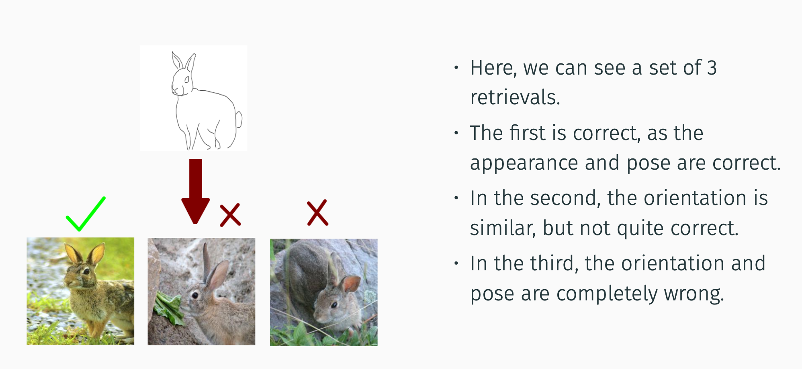
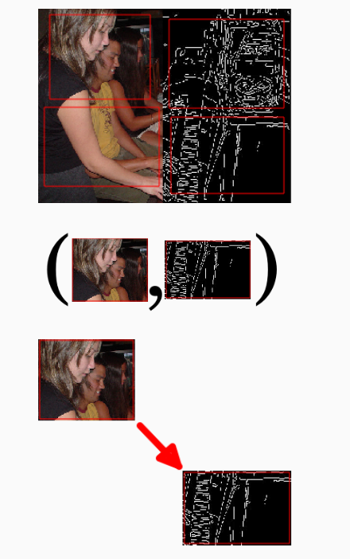
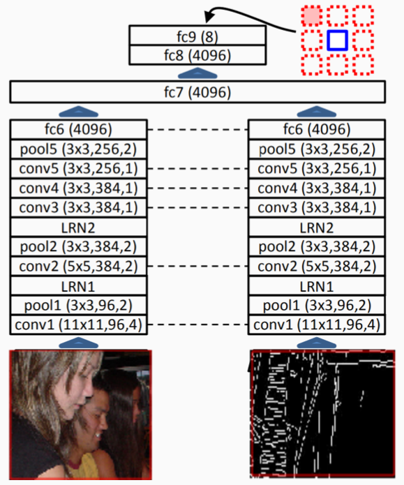
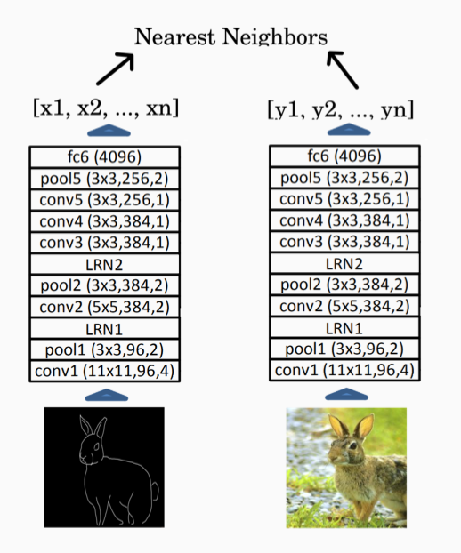
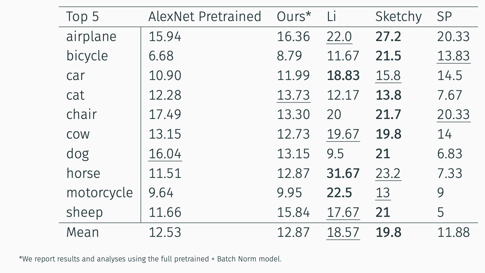

## Problem Statement
- Given a hand-drawn sketch, retrieve the image instance that this sketch was drawn for

## Related Work
- [Unsupervised Visual Representation Learning by Context Prediction](https://arxiv.org/abs/1505.05192)
- [The Sketchy Database: Learning to Retrieve Badly Drawn Bunnies](http://sketchy.eye.gatech.edu/paper.pdf)
- [Cross-modal Subspace Learning for fine-grained sketch-based image retrieval](https://www.sciencedirect.com/science/article/abs/pii/S0925231217314364#!)

## Approach

### Assumptions
- Aligned, paired images available. For this, we compute canny edges of the images in the PASCAL VOC dataset.
- Clustering image and sketch embeddings from a well-trained network will result in well-formed discrete clusters that are domain agnostic.
- The model that performs well on cross domain context prediction will perform well on the cross-domain image retrieval task.

### Pre-text Task
- We divide the image into 4 regions, with uneven spacing and jitter
- We then extract two patches, one from each domain, i.e. Images from Pascal, and their Canny edges
- We finally compute the relative positioning of the patches using the context encoder

### Image Retrieval
- We first compute embeddings for the query sketch using AlexNet trained on the pretext
- We then perform a nearest neighbour search on the embeddings from the dataset of images
- We retrieve the nearest 5 and 10 images for top-5 and top-10 similarity scores

## Experiments
TODO

## Results
TODO

